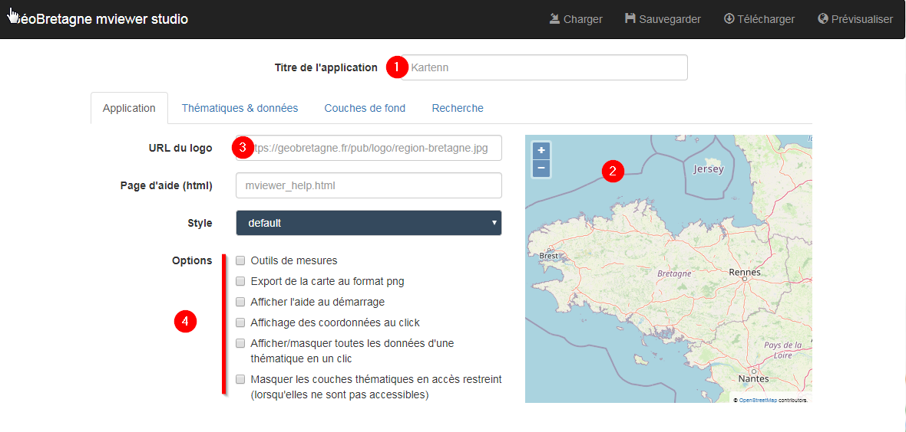
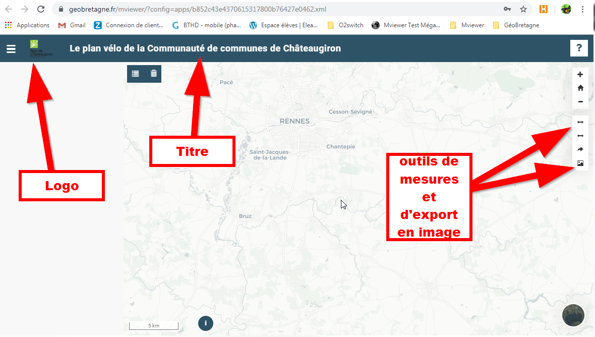
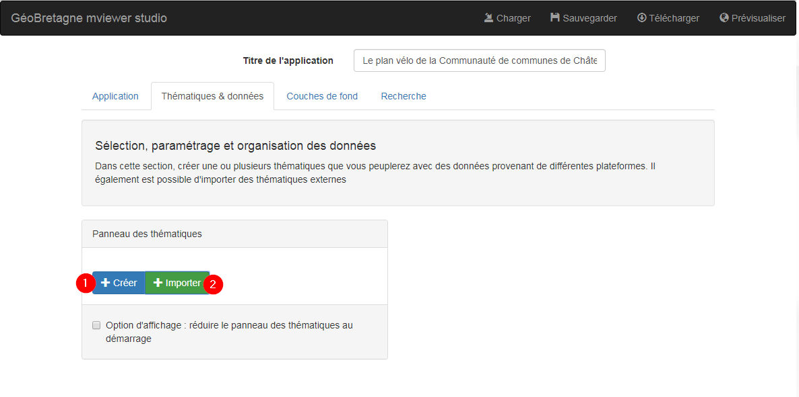
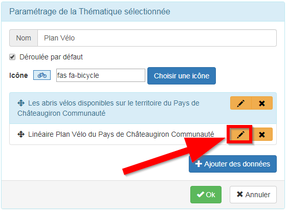
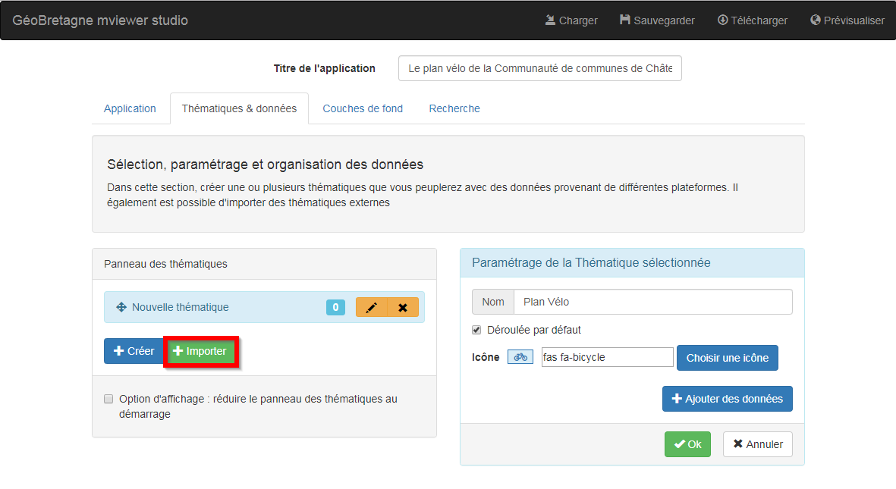
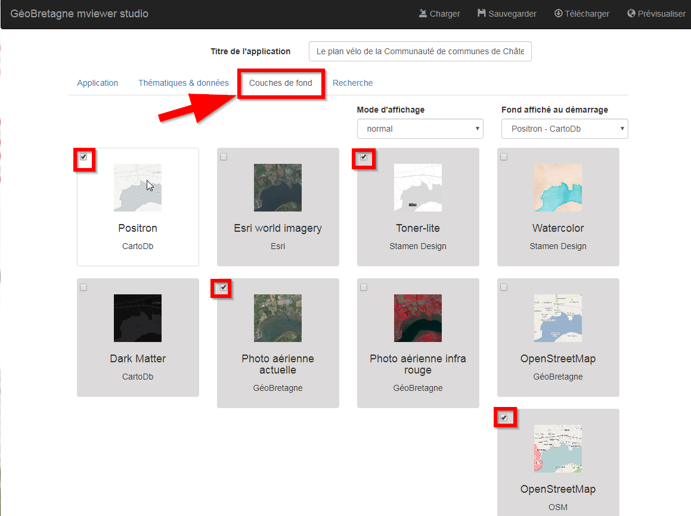

# Documentation utilisateur

mviewerstudio est une application qui permet de générer et de déployer des applications [mviewer](https://github.com/geobretagne/mviewer)

# Prérequis

Avant de vous lancer dans la belle aventure du mviewer studio et de goûter les joies de monter sa propre application cartographique, vous devrez malgré tout vous être assuré.e d'avoir rempli les prérequis suivants :

 - Le cas échéant, avoir demandé **les droits** aux administrateurs   
   pour vous connecter à l’application mviewerstudio.
  -  Avoir déposé le ou les jeux de données "métier" nécessaires sur un catalogue en **flux OGC** en respectant les    recommandations
   ([exemple sur GéoBretagne](https://cms.geobretagne.fr/content/deposer-des-donnees-shapefile-sur-geobretagne-grace-pydio)).
 - Avoir créé la ou les **fiches de métadonnées** nécessaires sur le catalogue partenaire (ou sur son propre catalogue CSW).
  -   Disposer des **fichiers de styles SLD** nécessaires.

*N.B sur GéoBretagne : pour plus de confort et d’autonomie, il est fortement conseillé d’être [administrateur délégué](https://cms.geobretagne.fr/content/administration-deleguee-sur-geoserver) de ses données sur GéoBretagne.*

# Paramétrer son application

 **1.** Renseigner le titre de votre application cartographique _(ex. "Le plan vélo de la Communauté de communes de Châteaugiron")_

**2.** Régler l'emprise de votre carte en utilisant les zoom +/- et le déplacement en cliquant à la souris sur la carte _(ex. ici on zoome sur le territoire de la Communauté de communes de Châteaugiron, ce sera le cadrage "par défaut" sur lequel arrivera l'utilisation sur l'application cartographique)_

**3.** Renseigner l'URL du logo de l'entité productrice de l'application** _**(info : sur GéoBretagne, les logos des partenaires sont stockés ici**_ [**https://geobretagne.fr/pub/logo/**](https://geobretagne.fr/pub/logo/)_**. Il apparaîtra dans le bandeau de l'application)**_

**4.** Cocher les options d'outils que vous souhaitez voir dans la carte  _(ex. des outils de mesures et un export au format image_)

À ce stade, vous pouvez déjà **sauvegarder votre application** et explorer le menu du haut :

**1. Sauvegarder** : pour enregistrer votre fichier de configuration (xml) sur l'espace du mviewer studio

**2. Prévisualiser** : pour pouvoir visualiser le résultat de votre application à tout moment

**3. Télécharger :** pour télécharger votre fichier xml de configuration en local

**4. Charger :** pour charger sur le mviewer studio un fichier xml existant en local

Exemple après avoir sauvegardé, je clique sur "**Prévisualiser**" et je visualise déjà le résultat de mon application à ce stade :

# Organiser ses données et thématiques

Le mot "**données**" correspond à un ou des jeu(x) de données que vous souhaitez ajouter à votre application. Vous avez la possibilité de regrouper un ou plusieurs jeux de données sous une "**thématique**". Exemple, je veux ajouter les deux couches de données (linéaire du plan vélo et des abris vélo) sous une thématique "Plan Vélo".

**1.Créer **: pour créer votre thématique et y associer vos jeux de données "métier"

**2. Importer **: pour réutiliser une thématique déjà créée au sein de la communauté mviewer (ex. la thématique des découpages territoriaux qui contient les limites de communes, EPCI et départements

## Option - Créer une thématique

En cliquant sur "**Ajouter des données**", vous pouvez chercher un jeu de données dans le catalogue (ex. GéoBretagne), soit **(1)** par mot-clé (cas le plus courant), soit **(2)** en renseignant l'adresse du catalogue fournisseur (ou du service WMS) :

Les données nécessaires ont été ajoutées à la thématique, vous cliquez sur **OK** (pensez à sauvegarder et télécharger votre fichier de configuration !) :

Pour modifier la façon de **visualiser/interroger** un jeu de données, cliquez ici :

Aller dans les différents onglets faire les paramétrages.

### Onglet Base

La plupart des informations sont récupérées des flux. Si c’est bien renseigné, il n’y a rien à changer à part éventuellement le titre de la donnée qui apparaîtra dans votre application mviewer.

### Onglet Fiche

Exemple sur l'onglet FICHE dans format de la fiche d’information, on clique sur "*personnalisé*" pour paramétrer ce qui apparaitra dans la fiche info quand on cliquera sur une portion du linéaire :

On choisit les champs que l’on veut afficher dans la fiche d’information et le type (titre, texte, lien, image…).

### Onglet Affichage

On peut aussi y paramétrer la légende (fichier SLD) dans l’onglet **Affichage**. Si le SLD n'a pas été créé et stocké sur GéoBretagne, on peut entrer une URL externe (et un png pour l'affichage de la légende) :

### Onglet Filtre

L’onglet **Filtre** permet de filtrer la donnée. On peut avoir un filtre géographique ou attributaire. Exemple ici avec un filtre sur un code SIREN :

### Onglet Liste de choix

L’onglet **Liste de choix** permet d’avoir dans son application la possibilité de faire un filtre sur la valeur à afficher. Exemple ici on pourra filtrer les structures qui ont un multi accueil ou pas :

## Option - Récupérer une thématique existante

Choisir dans la liste la ou les thématiques que vous souhaitez récupérer et cliquer sur "**Importer**" en bas de page :

A ce stade, vous avez vos deux thématiques :

En cliquant sur **Prévisualiser**, vous accédez à votre applicatif cartographique en ligne :

*N.B : la liste des thématiques est en cours d’élaboration, il est possible qu’il y ait des erreurs.*

# Paramétrer les couches de fond

<!--stackedit_data:
eyJoaXN0b3J5IjpbMTc3NTU2MTYwNiwtNjQ1MzE3MDA1LC0xNz
M0NDA4NTQzLC0xMzA0NjMzMjc0LDM0MjAzNjg4LC0yMDY2NDE2
MjUyLDg5MDkzNzU5MywxMzcyNTgxMTQzLC02MzM5NjAxMTgsLT
Y2MDk5NzcyNiwtMTc0MDk2MDI4MSw5OTI5NzM4MDQsMTg0ODg0
MzgxMCwyMzI2MzE0MiwtMjEzOTcyNDY1NV19
-->