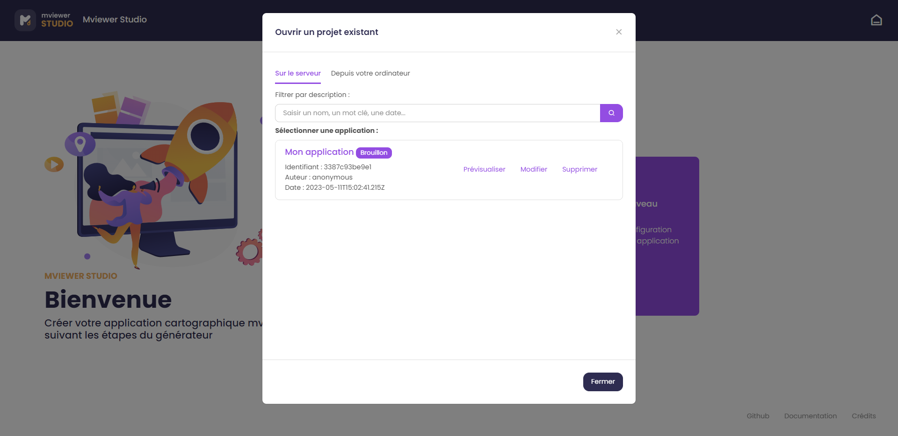

.. Authors : 
.. mviewer team

.. _accueil:

Bien commencer
=====================

mviewerstudio est un générateur d'applications basé sur le visualiseur géographique mviewer_. Il permet à tout utilisateur de créer son application cartographique mviewer en suivant les étapes de l'assistant de configuration.

.. image:: ../_images/user/mviewerstudio_0_accueil.png
              :alt: Interface utilisateur mviewerstudio
              :align: center

Prérequis
-------------------------------------------

Avant de vous lancer dans la belle aventure du mviewerstudio et de goûter les joies de monter sa propre application cartographique, vous devrez malgré tout vous être assuré·e d'avoir rempli les prérequis suivants :

* Le cas échéant, disposer d'un compte avec  **les droits suffisants** pour vous connecter au mviewerstudio, si ce n'est pas le cas merci de contacter le·s administrateur·rice·s.
* Avoir déposé le ou les jeux de données "métier" nécessaires sur un catalogue en  **flux OGC**  en respectant les recommandations (exemple sur GéoBretagne_).
* Avoir créé la ou les  **fiches de métadonnées**  nécessaires sur le catalogue partenaire (ou sur son propre catalogue CSW).
* Disposer des  **fichiers de styles** (SLD) nécessaires.

.. note:: Sur GéoBretagne : pour plus de confort et d'autonomie, il est fortement conseillé d'être administrateur délégué_ de ses données.

Ouvrir une application existante
-------------------------------------------

Deux choix sont offerts à l'utilisateur :

* **Ouvrir un projet existant disponible sur un espace de stockage distant (serveur)**

Chaque application accessible peut être prévisualisée, modifiée ou supprimée en cliquant sur les boutons associés. Si vous n'avez que le droit de prévisualisation c'est que l'application a été créée par un autre utilisateur de votre organisation. On visualise quelles sont les applications publiées, c'est à dire "en ligne" et les applications en mode "brouillon".

Il est également possible de filtrer les applications selon un mot clé, une date ou un auteur à l'aide de la barre de recherche en haut.

Cliquez sur "Modifier" pour accéder à l'éditeur d'application.

* **Ouvrir un projet existant disponible sur un espace de stockage local (fichier XML sur votre ordinateur)**

.. image:: ../_images/user/mviewerstudio_0_accueil_projet_existant_local.png
              :alt: Projet existant local
              :align: center

Création d'un nouveau projet
-------------------------------------------

Le générateur permet de créer son application en trois étapes :

:ref:`param_appli`

:ref:`param_data`

:ref:`publication`

L'utilisateur peut basculer entre les étapes en cliquant sur l'étape de son choix via l'arbre de gauche ou via les boutons de bas de page Précédent |precedent| / Suivant |suivant|.

.. |suivant| image:: ../_images/user/mviewerstudio_1_application_bouton_suivant.png
            :alt: Suivant 
            :width: 70 pt

.. |precedent| image:: ../_images/user/mviewerstudio_1_application_bouton_precedent.png
            :alt: Précédent 
	        :width: 70 pt

Il est aussi possible d'enregistrer  |enregistrer|, de prévisualiser |previsualiser| ou de supprimer son projet tout le long du parcours de création.

.. |enregistrer| image:: ../_images/user/mviewerstudio_1_application_bouton_enregistrer.png
        :alt: Enregistrer 
        :width: 70 pt

.. |previsualiser| image:: ../_images/user/mviewerstudio_1_application_bouton_previsualiser.png
        :alt: Prévisualiser 
        :width: 70 pt

Modes
-------------------------------------------

Deux modes sont proposés pour des parcours utilisateur :

* mode simple par défaut

.. image:: ../_images/user/mviewerstudio_1_application.png
              :alt: Mode simple
              :align: center

* mode avancé :guilabel:`mode avancé` avec des fonctionnalités supplémentaires pour les utilisateurs avancés

.. image:: ../_images/user/mviewerstudio_1_application_avance.png
              :alt: Mode avancé
              :align: center

Crédits
-------------------------------------------

Les liens en bas de page renvoient vers :

* le dépôt du code github
* la documentation sur readthedocs
* une fenêtre crédits avec les ressources utilisées (librairies, icônes, illustrations) :

.. image:: ../_images/user/mviewerstudio_0_accueil_credits.png
              :alt: Crédits
              :align: center

.. _mviewer: https://github.com/mviewer/mviewer

.. _délégué: https://cms.geobretagne.fr/sites/default/files/documents/202410_geobretagne_manuel_administrateur.pdf

.. _GéoBretagne: https://cms.geobretagne.fr/sites/default/files/documents/202410_geobretagne_manuel_administrateur.pdf
