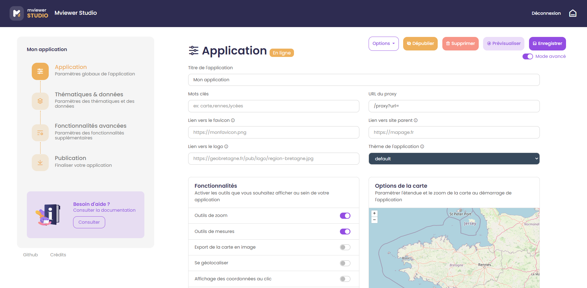
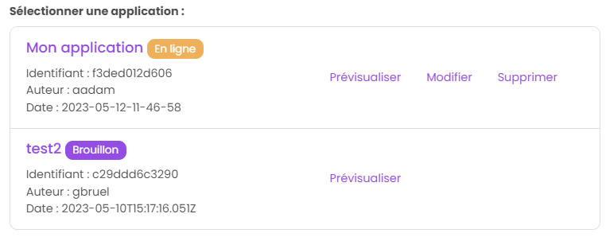
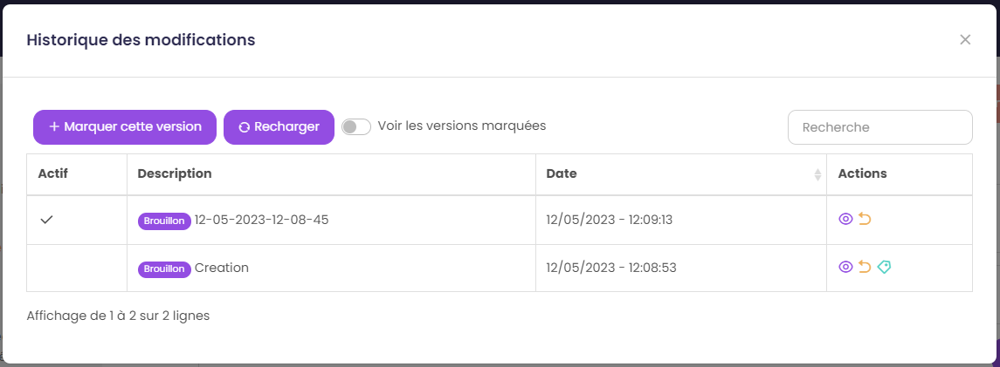
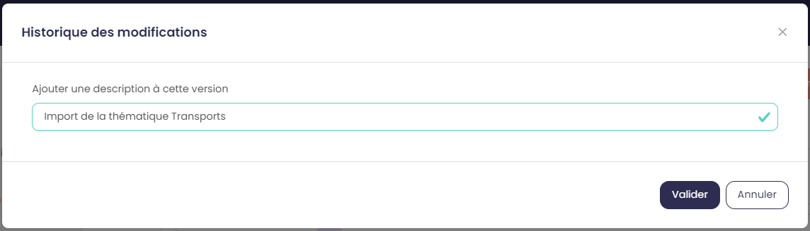
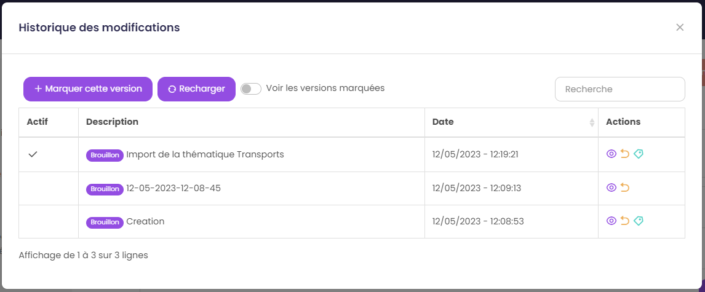
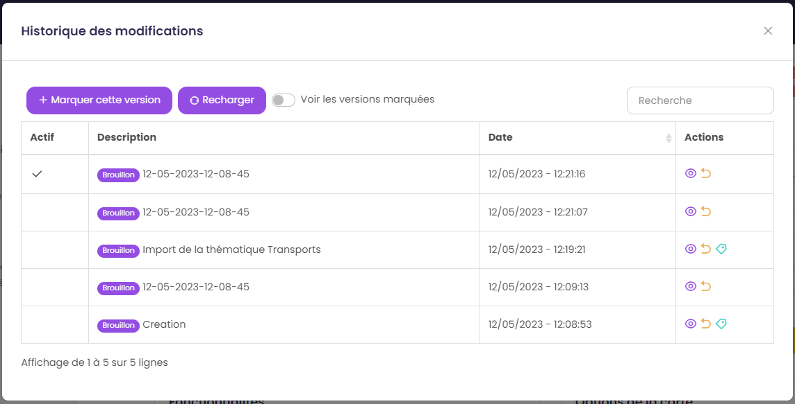

.. Authors : 
.. mviewer team

.. _gestion_appli:

Gérer son application
=====================

La gestion de son application est possible depuis la barre de navigation située en haut à droite des différents modules du studio :

* ``Enregistrer`` : permet d'enregistrer les modifications de son application.
* ``Prévisualiser`` : permet de prévisualiser son application avec la configuration actuelle dans un nouvel onglet du navigateur.
* ``Supprimer`` : permet de supprimer définitivement son application.
* ``Dépublier`` : permet de dépublier son application quand celle-ci a été publiée auraparavant (voir rubrique ci-dessous).
* ``Options`` :guilabel:`mode avancé` : permet d'accéder à des options supplémentaires. Visible seulement si l'application est enregistrée.

Gérer la publication d'une application
-------------------------------------------

.. note:: Note
        Cette fonctionnalité est disponible si et seulement si l'instance sur laquelle vous créez votre application est configurée pour publier une application en production.

Par défaut, une nouvelle application est créee en mode "brouillon". Le mode "brouillon" signifie que l'application est disponible depuis le mviewer studio, les modifications sont enregistrables et prévisualisables. Toutefois, l'application n'est pas accessible en ligne via une url stable tant qu'elle n'a pas été publiée. 

Dès que l'application a été publiée, comme expliqué dans la rubrique 3, le statut de celle-ci devient "en ligne". Votre application est alors accessible par tous via le lien disponible dans la fenêtre de publication. 

Nouvelles modifications
~~~~~~~~~~~~~~~~~~~~~~~

Lorsque vous réalisez de nouvelles modifications sur votre application, il est nécessaire de la republier pour appliquer les changements à votre application en ligne.

Dépublier une application
~~~~~~~~~~~~~~~~~~~~~~~~~

Il est possible de dépublier une application, si par exemple les données sont obsolètes. Pour la rendre innaccessible, cliquez sur le bouton "Dépublier" dans la barre de navigation. Après cette action, votre application passera en mode "brouillon". Les ressources associées seront également supprimées du serveur de production. 

Vous pouvez donc effectuer les changements nécessaires et la publier de nouveau dès que l'application est stable.

Gérer l'historique des modifications
-------------------------------------------

.. note:: Note
        Cette fonctionnalité est accessible en :guilabel:`mode avancé`.

Lorsque l'on enregistre une application, chaque enregistrement est consigné en associant les modifications réalisées. Cet historique des modifications est visible dans une nouvelle fenêtre depuis le bouton "Options", "Historique des modifications" :

Créer une version
~~~~~~~~~~~~~~~~~

Il est possible de créer une version spécifique avec des modifications associées.

Après avoir importé une nouvelle thématique dans l'application, ouvrez la fenêtre "Historique des modifications" puis cliquez sur "Marquer cette version". Ajoutez ensuite une description à la version et enregistrez: 

Cette version marquée est maintenant disponible et identifiée dans l'historique. 

Gérer les versions
~~~~~~~~~~~~~~~~~~~

Depuis la fenêtre "Historique des modifications", il est possible de gérer les versions avec les actions suivantes :

* ``Voir les versions marquées`` : permet de filtrer les versions marquées par l'utilisateur
* ``Prévisualiser`` : en cliquant sur l'icône "oeil" dans le tableau, l'utilisateur peut prévisualiser les versions précédentes dans un nouvel onglet du navigateur
* ``Restaurer`` : en cliquant sur l'icône "flèche" dans le tableau, l'utilisateur peut restaurer son application à une version précédente. Attention, cette action est irréversible, les modifications antérieures à la version restaurée seront supprimées. 