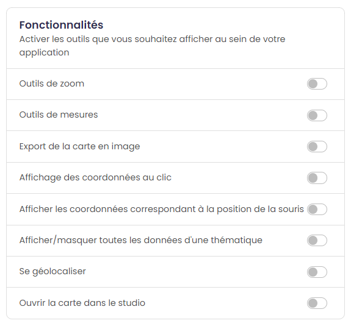

.. Authors : 
.. mviewer team

.. _param_appli:

1) Paramétrer son application
==============================

Le mode simple est servi par défaut. Vous pouvez basculer à tout moment sur le :guilabel:`mode avancé` en cliquant en haut à droite comme ci-dessous.

.. image:: ../_images/user/mviewerstudio_1_application_defaut.png
              :alt: Page application
              :align: center

Champs principaux
-------------------------------------------

* ``Titre de l'application`` (\* champ obligatoire) : renseigner le titre de votre application cartographique (ex. "Le plan vélo de la Communauté de communes de Châteaugiron"). Il ne sera pas possible de changer de page sans renseigner de titre.
* :guilabel:`mode avancé` ``Mots clés`` : indiquer des mots clés permettant de décrire l'application.
* :guilabel:`mode avancé` ``URL du proxy`` : lien vers le proxy permettant l’interrogation CROSS DOMAIN des couches (Plus d'informations sur le proxy_).
* :guilabel:`mode avancé` ``Lien vers le favicon`` : renseigner l'URL du fichier image à utiliser comme favicon de l’application.
* :guilabel:`mode avancé` ``Lien vers le site parent`` : renseigner le lien d'une page web vers laquelle l'utilisateur sera redirigé en cliquant sur le logo de l'application mviewer.
* ``Lien vers le logo`` : renseigner l'URL du logo de l'entité productrice de l'application qui apparaitra dans dans le bandeau de l'application (Exemple sur GéoBretagne, les logos des partenaires sont stockés ici_).
* ``Thème de l'application`` : choisir le thème permettant de personnaliser l'interface de votre application (couleur).

Fonctionnalités
-------------------------------------------

Activer les outils que vous souhaitez afficher au sein de votre application :

* ``Outils de zoom`` : cette option permet d'activer les outils de zoom +/- sur la carte.
* ``Outils de mesures`` : cette option permet d'activer les outils de mesures de distance et de surface.
* ``Export de la carte en image`` : cette option permet d'exporter une capture d'écran de la carte consultée.
* :guilabel:`mode avancé` ``Affichage des coordonnées au clic`` : cette option permet d'afficher dans le bandeau en haut les coordonnées du point cliqué.
* :guilabel:`mode avancé` ``Afficher les coordonnées correspondant à la position de la souris`` : cette option permet d'afficher les coordonnées correspondant à la position de la souris en bas à droite de la carte .
* :guilabel:`mode avancé` ``Afficher/masquer toutes les données d'une thématique`` : active la possibilité d'afficher toutes les données d'un thème en un clic.
* ``Se géolocaliser`` : cette option permet d'activer l'outil de géolocalisation (bouton permettant à l'utilisateur de se localiser sur la carte).
* :guilabel:`mode avancé` ``Ouvrir la carte dans le studio`` : active la possibilité d'ouvrir la carte en cours au sein d'un mviewerstudio pour édition.

Options de la carte
-------------------------------------------

Paramétrer l'étendue et le zoom de la carte au démarrage de l'application. Ainsi, l'emprise de la carte sera le cadrage "par défaut" pour l'utilisateur à l'ouverture de l'application cartographique. L'affichage par défaut est paramétrable dans le fichier de configuration (voir option zoom et center dans :ref:`config_front`).

.. image:: ../_images/user/mviewerstudio_1_application_carte.png
              :alt: Options de la carte
              :align: center

* ``Revenir à l'étendue initiale`` : cette option permet d'activer le bouton de retour à l’étendue initiale.
* :guilabel:`mode avancé` ``Interdire la navigation hors de l'étendue définie ci-dessus`` : bloque l'emprise de la carte sur l'emprise définie.

Fonds de plan
-------------------------------------------

Sélectionner les fonds de plan à afficher en cochant la case ainsi que le fond de plan au démarrage.

.. image:: ../_images/user/mviewerstudio_1_application_fonds_de_plan.png
              :alt: Options de la carte
              :align: center

* ``Fond de plan au démarrage`` : choix du fond de plan affiché par défaut .
* ``Mode d'affichage`` : choix entre le mode normal ou gallerie pour le changement de fond de plan :guilabel:`mode avancé`.

En :guilabel:`mode avancé`, il est possible de rajouter un fond de plan personnalisé à l'aide de ses paramètres en activant la checkbox. Veuillez ensuite sélectionner le type de couche parmi la liste et renseigner les champs nécessaires :

* ``Identifiant`` : paramètre obligatoire de type texte pour attribuer un identifiant unique et interne à la couche
* ``Libellé`` : paramètre obligatoire de type texte pour définir le nom du fond de plan
* ``URL`` : paramètre obligatoire de type url définissant l’URL du service web OSM, WMTS, WMS ou vector-tms.
* ``Identifiant technique de la couche`` : paramètre obligatoire de type texte définissant l'identifiant technique de la couche à utiliser
* ``Attribution`` : paramètre obligatoire alimentant le contrôle attributions de la carte
* ``Sous-titre`` : informations complémentaires sur le fond de plan comme le producteur
* ``Lien vers la vignette d'aperçu`` : paramètre obligatoire de type url permettant de sélectionner l’imagette à associer au fond de plan.
* ``Format d'image`` : paramètre optionnel de type texte définissant le format d’image retourné par le serveur. (Obligatoire pour les couches de type WMS et WMTS)
* ``Nom du style`` : paramètre optionnel précisant le style à associer à la couche. (Obligatoire pour les couches de type WMTS et vector-tms. Pour le type vector-tms, le style correspond à la valeur indiquée en tant que première clé de la propriété « sources » du fichier de style au format JSON).
* ``Matrixset`` : paramètre optionnel précisant le style à associer à la couche. Paramètre obligatoire pour les couches de type WMTS si le paramètre fromcapacity n’est pas activé
* ``Lien vers le fichier de style (JSON)`` : paramètre optionnel de type url définissant le fichier de style au format JSON à utiliser. (Obligatoire pour les couches de type vector-tms)

**Synthèse des options**

.. list-table:: Par type (en gras obligatoire)
   :widths: 25 25 25 25
   :header-rows: 1

   * - Type
     - WMTS
     - WMS
     - Vector-TMS
   * - Identifiant
     - **X**
     - **X**
     - **X**
   * - Libellé
     - **X**
     - **X**
     - **X**
   * - URL
     - **X**
     - **X**
     - **X**
   * - Identifiant technique
     - **X**
     - **X**
     - **X**
   * - Attribution
     - **X**
     - **X**
     - **X**
   * - Sous-titre
     - x
     - x
     - x
   * - Lien vers vignette
     - **X**
     - **X**
     - **X**
   * - Lien vers fichier de style
     -
     - 
     - **X**
   * - Format d'image
     - **X**
     - **X**
     - 
   * - Nom du style
     - **X**
     - 
     - **X**
   * - Matrixset
     - x
     - 
     - 

**Exemples de saisies**

.. list-table:: 
   :widths: 25 25 25 25
   :header-rows: 1

   * - Type
     - WMTS
     - WMS
     - Vector-TMS
   * - Identifiant
     - ign_rpg
     - osm_default
     - ign_bdtopo
   * - Libellé
     - RPG IGN
     - OpenStreetMap GéoBretagne
     - BDTOPO IGN
   * - URL
     - https://data.geopf.fr/wmts
     - https://tile.geobretagne.fr/osm/service
     - https://wxs.ign.fr/topographie/geoportail/tms/1.0.0/BDTOPO/{z}/{x}/{y}.pbf
   * - Identifiant technique
     - LANDUSE.AGRICULTURE2021
     - osm:map
     - BDTOPO
   * - Attribution
     - IGN RPG
     - OpenStreetMap
     - IGN BDTOPO
   * - Sous-titre
     - IGN RPG
     - OpenStreetMap
     - IGN BDTOPO
   * - Lien vers vignette
     - https://geobretagne.fr/pub/logo/099_ign.jpg
     - https://geobretagne.fr/pub/logo/161_osmfr.jpg
     - https://geoservices.ign.fr/sites/default/files/2022-04/BD%20TOPO%20-%20600x286px_0.png
   * - Lien vers fichier de style
     -
     - 
     - https://wxs.ign.fr/static/vectorTiles/styles/BDTOPO/routier.json
   * - Format d'image
     - image/png
     - image/png
     - 
   * - Nom du style
     - normal
     - 
     - bdtopo
   * - Matrixset
     - PM
     - 
     - 

Après avoir renseigné l'ensemble des paramètres valides, cliquez sur "Ajouter". Le fond de plan apparaît dans la liste. Il est nécessaire de l'activer pour qu'il soit visible dans l'application.

.. note:: Note
        Il n'est pas possible de modifier les paramètres d'un fond de plan ajouté. Il faut réitérer la saisie.

Recherche
-------------------------------------------

Activer la recherche pour offrir à vos utilisateurs la possibilité de se localiser grâce à une barre de recherche :

.. image:: ../_images/user/mviewerstudio_1_application_recherche.png
              :alt: Recherche
              :align: center

* ``A l'adresse`` : localisation à l'adresse via le service de la Base adresse nationale ou tout autre service.
* ``Activer la recherche d'entités`` :guilabel:`mode avancé`: la recherche peut être activée si la donnée est de type GEOJSON. Cette fonctionnalité est également activable pour les données de type WMS à la condition que les entités qui composent cette donnée soient également indéxées dans Elasticsearch. 

Page d'accueil (:guilabel:`mode avancé`)
-------------------------------------------

Il est possible de paramétrer une page d'accueil / documentation en indiquant un lien vers une page web (format .html).

.. image:: ../_images/user/mviewerstudio_1_application_page_accueil.png
              :alt: Page d'accueil
              :align: center

* ``Titre de la fenêtre d'aide / accueil`` :guilabel:`mode avancé`: Indiquer le titre de la modal avec les informations relatives à l'application (accueil ou aide).
* ``Icône du bouton`` :guilabel:`mode avancé`: Sélectionner une icône pour le bouton d'accès à la page d'aide (localisé dans le bandeau de l'application).
* ``Lien vers la page d'accueil`` :guilabel:`mode avancé`: Indiquer l'URL vers la page d'aide au format .html.
* ``Afficher la page d'accueil par défaut`` :guilabel:`mode avancé`: Affiche la page d'accueil au lancement de l'application.

Navigation
-------------------------------------------

A la fin du paramétrage de la rubrique « Application », l'utilisateur clique sur le bouton suivant pour poursuivre la configuration de son application cartographique en passant à la rubrique « Thématiques et données ». Une sauvegarde de l'application sera réalisée à ce moment là.

.. image:: ../_images/user/mviewerstudio_1_application_fin.png
              :alt: Bouton suivant
              :align: center

.. _ici: https://geobretagne.fr/pub/logo/
.. _proxy: https://mviewerdoc.readthedocs.io/fr/stable/doc_tech/config_proxy.html

