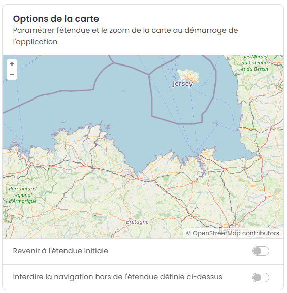
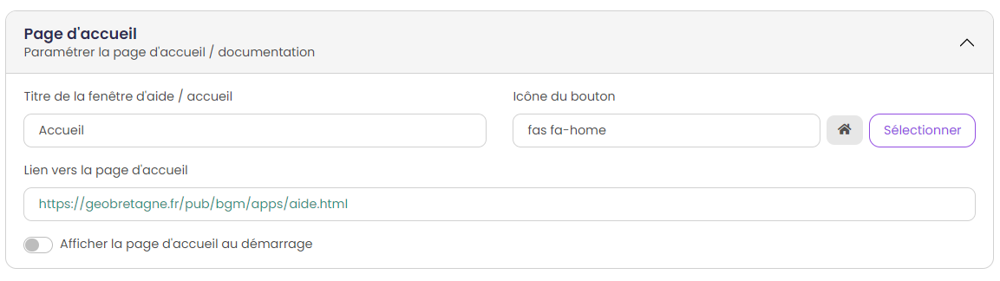

.. Authors : 
.. mviewer team

.. _param_appli:

1) Paramétrer son application
==============================

Le mode simple est servi par défaut. Vous pouvez basculer à tout moment sur le mode avancé :guilabel:`mode avancé` en cliquant en haut à droite comme ci-dessous.

Champs principaux
-------------------------------------------

* ``Titre de l'application`` (\* champ obligatoire) : renseigner le titre de votre application cartographique (ex. "Le plan vélo de la Communauté de communes de Châteaugiron").
* ``Lien vers le logo`` : renseigner l'URL du logo de l'entité productrice de l'application qui apparaitra dans dans le bandeau de l'application (Exemple sur GéoBretagne, les logos des partenaires sont stockés ici_).

* ``Thème de l'application`` : choisir le thème permettant de personnaliser l'interface de votre application (couleur).

Fonctionnalités
-------------------------------------------

Activer les outils que vous souhaitez afficher au sein de votre application :

* ``Outils de mesures`` : cette option permet d'activer des outils de mesures de distance ou de surface.
* ``Export de la carte en image`` : cette option permet d'exporter une capture d'écran de la carte consultée.
* ``Affichage des coordonnées au clic`` : cette option permet d'afficher dans le bandeau en haut les coordonnées du point cliqué :guilabel:`mode avancé`.
* ``Afficher/masquer toutes les données d'une thématique`` : active la possibilité d'afficher toutes les données d'un thème en un clic :guilabel:`mode avancé`.

Options de la carte
-------------------------------------------

Paramétrer l'étendue et le zoom de la carte au démarrage de l'application. Ainsi, l'emprise de la carte sera le cadrage "par défaut" pour l'utilisateur à l'ouverture de l'application cartographique.

* ``Interdire la navigation hors de l'étendue définie ci-dessus`` : bloque l'emprise de la carte sur l'emprise définie :guilabel:`mode avancé`.

Fonds de plan
-------------------------------------------

Sélectionner les fonds de plan à afficher en cochant la case ainsi que le fond de plan au démarrage. 

.. image:: ../_images/user/mviewerstudio_1_application_fonds_de_plan.png
              :alt: Options de la carte
              :align: center

* ``Fond de plan au démarrage`` : choix du fond de plan affiché par défaut .
* ``Mode d'affichage`` : choix entre le mode normal ou gallerie pour le changement de fond de plan :guilabel:`mode avancé`.

Recherche [:guilabel:`mode avancé`]
-------------------------------------------

Activer la recherche pour offrir à vos utilisateurs la possibilité de se localiser grâce à une barre de recherche :

.. image:: ../_images/user/mviewerstudio_1_application_recherche.png
              :alt: Recherche
              :align: center

* ``A l'adresse`` : localisation à l'adresse via le service de la Base adresse nationale ou tout autre service.
* ``Activer la recherche d'entités`` : la recherche peut être activée si la donnée est de type GEOJSON. Cette fonctionnalité est également activable pour les données de type WMS à la condition que les entités qui composent cette donnée soient également indéxées dans Elasticsearch :guilabel:`mode avancé`. 

Page d'accueil
-------------------------------------------

Il est possible de paramétrer une page d'accueil / documentation en indiquant un lien vers une page web (format .html).

* ``Afficher la page d'accueil par défaut`` : affiche la page d'accueil au lancement de l'application :guilabel:`mode avancé`.

Navigation
-------------------------------------------

A la fin du paramétrage de la rubrique « Application », l'utilisateur clique sur le bouton suivant pour poursuivre la configuration de son application cartographique en passant à la rubrique « Thématiques et données ».

.. image:: ../_images/user/mviewerstudio_1_application_fin.png
              :alt: Bouton suivant
              :align: center

.. _ici: https://geobretagne.fr/pub/logo/
