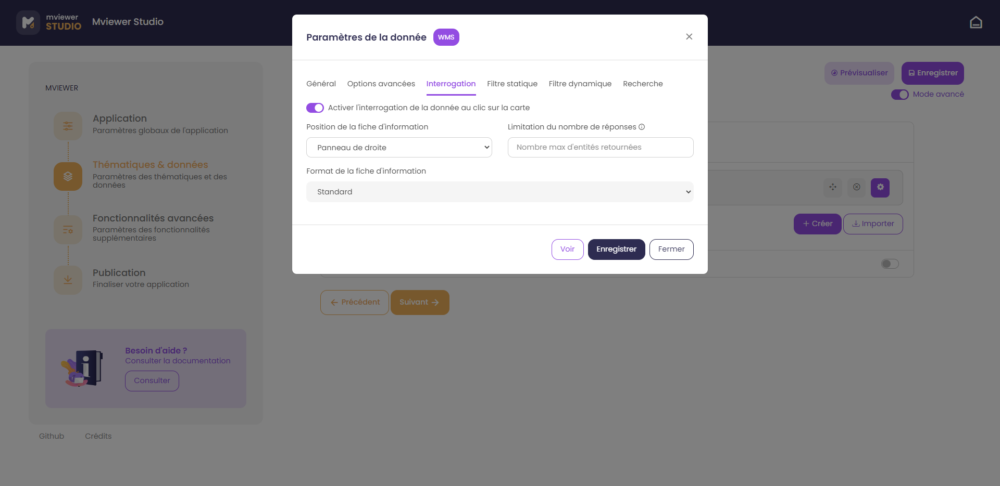
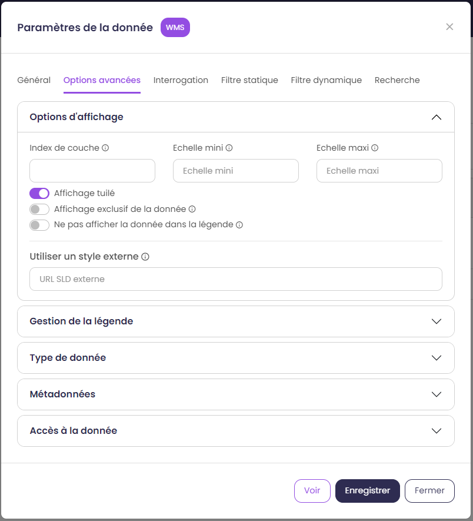
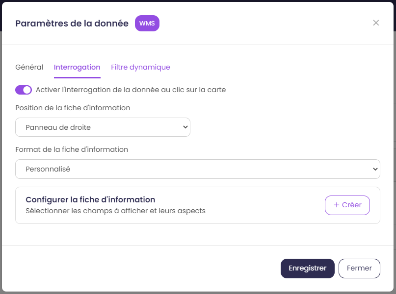
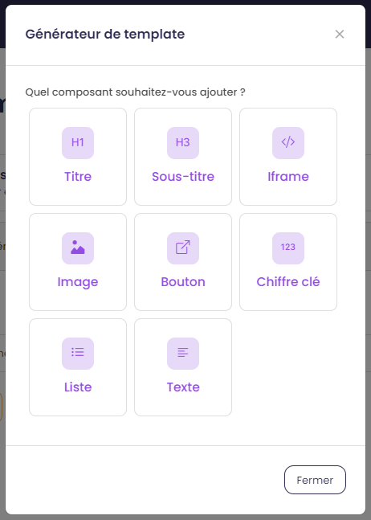
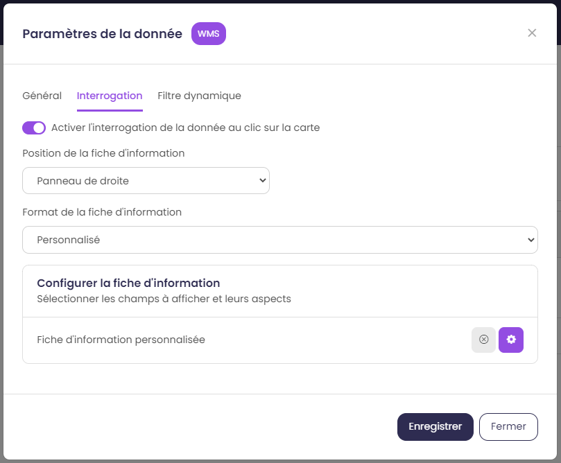

.. Authors : 
.. mviewer team

.. _param_data:

2) Thématiques & données
=========================

Définir les thématiques et les données de son application.

.. image:: ../_images/user/mviewerstudio_2_thematiques.png
              :alt: Définition thématique
              :align: center

Paramétrer ses thématiques
-------------------------------------------

L'utilisateur peut organiser le panneau des thématiques et des données présentes à gauche de l'application.

Le mot "données" correspond à un ou des jeu(x) de données que vous souhaitez ajouter à votre application. Vous avez la possibilité de regrouper un ou plusieurs jeux de données sous une "thématique". Exemple, je veux ajouter les deux couches de données (linéaire du plan vélo et des abris vélo) sous une thématique "Plan Vélo".

Deux options sont offertes à l'utilisateur pour définir ses thématiques :

  1. Créer : pour créer votre thématique et y associer vos jeux de données "métier"
  2. Importer : pour réutiliser une thématique déjà créée au sein de la communauté mviewer (ex. la thématique des découpages territoriaux qui contient les limites de communes, EPCI et départements)

Option - Créer une thématique
~~~~~~~~~~~~~~~~~~~~~~~~~~~~~~

En cliquant sur le bouton créer, une fenêtre de paramétrage de la thématique sélectionnée s'ouvre.

.. image:: ../_images/user/mviewerstudio_2_thematiques_creer.png
              :alt: Création thématique
              :align: center

- ``Nom`` : renseigner le nom de la thématique (ex. Ports).

- ``Déroulée par défaut`` : option permettant d'afficher le contenu de la thématique par défaut

- ``Icône`` : sélectionner l'icône illustrant la thématique. Pour rechercher un mot clé en anglais, utiliser la recherche du navigateur (taper CRTL+F).

Option - Importer une thématique externe
~~~~~~~~~~~~~~~~~~~~~~~~~~~~~~~~~~~~~~~~~~~~~~~~

En cliquant sur Importer, vous pouvez importer une·des thématique·s existante·s (voir option external_themes dans :ref:`config_front`).

.. image:: ../_images/user/mviewerstudio_2_thematiques_importer.png
              :alt: Import thématique
              :align: center

Il est possible de filtrer les thématiques à l'aide de la barre de recherche en saisissant un mot clé (thème, organisme) et de gérer l'affichage des thématiques grâce au sustème de pagination.

Les thématiques importées ne sont pas configurables, elles sont visibles dans l'application comme elles sont définies dans l'application source (nom, icône, données et options des données).
Il est toutefois possible de gérer certains paramètres. Dans la liste des thématiques, cliquez sur le bouton |parametrage|.

.. |parametrage| image:: ../_images/user/mviewerstudio_2_parametrage.png
              :alt: Editer cette donnée 
	      :width: 20 pt

Une nouvelle fenêtre s'ouvre avec les options suivantes : 

- ``Affichage des données de la thématique`` : Option permettant de gérer l'affichage des données de la thématique lors du démarrage de l'application.

Ajouter une donnée
-------------------------------------------

Il est ensuite nécessaire d'ajouter des données à cette thématique via le bouton |ajout_donnees|. L'ajout d'un nouveau jeu de données peut se faire avec une recherche dans un catalogue et en saisissant les paramètres de base.

.. |ajout_donnees| image:: ../_images/user/mviewerstudio_2_thematiques_bouton_ajouter_donnees.png
              :alt: Ajouter une donnée 
	      :width: 100 pt

Ajouter une donnée depuis un catalogue
~~~~~~~~~~~~~~~~~~~~~~~~~~~~~~~~~~~~~~~~

Vous pouvez chercher un jeu de données dans un catalogue (ex. Région Bretagne). Vous pouvez valider votre recherche en tapant sur la touche Entrée de votre clavier ou sur l'icone loupe :

.. image:: ../_images/user/mviewerstudio_2_thematiques_donnees.png
              :alt: Ajouter une donnée
              :align: center

- par mot-clé :

.. image:: ../_images/user/mviewerstudio_2_thematiques_donnees1.png
              :alt: Chercher une donnée
              :align: center

- :guilabel:`mode avancé` en renseignant l'adresse du catalogue fournisseur ou d'un service WMS

.. image:: ../_images/user/mviewerstudio_2_thematiques_donnees_avance.png
              :alt: Chercher une donnée
              :align: center

Ajouter une donnée depuis des paramètres
~~~~~~~~~~~~~~~~~~~~~~~~~~~~~~~~~~~~~~~~

Si le jeu de donnée n'est pas disponible dans un catalogue, il est possible de rajouter une donnée à l'aide des paramètres. Cliquez sur le second onglet et sélectionnez le type de la donnée parmi la liste. Indiquez ensuite les paramètres en veillant à leur validité :

* ``ID`` : paramètre de type texte qui renseigne l’identifiant technique de la couche côté serveur WMS ou WFS
* ``Nom`` : nom de la donnée dans l'application
* ``URL`` : paramètre de type URL (URL du service web)
* ``Lien vers le fichier de style`` : pour les couches de type vector-tms uniquement, il indique l’URL vers le fichier de style au format JSON.
* ``Nom du style`` : pour les couches de type vector-tms uniquement, titres à utiliser pour la liste des styles associés

Paramétrer ses données
-------------------------------------------

Une fois cliqué sur Sélectionner, la donnée est ajoutée à l'arborescence. Vous pouvez modifier les paramétrages en cliquant sur |parametrage|.

.. image:: ../_images/user/mviewerstudio_2_ajout_donnee.png
              :alt: Donnée ajoutée
              :align: center

.. |parametrage| image:: ../_images/user/mviewerstudio_2_parametrage.png
              :alt: Editer cette donnée 
	      :width: 20 pt

Onglet Général
~~~~~~~~~~~~~~~

L'onglet général recense les principales options de la donnée.

.. image:: ../_images/user/mviewerstudio_2_donnees_general.png
              :alt: Onglet Général
              :align: center

* ``Nom`` : nom de la donnée dans notre application.
* ``Attribution`` : source de la donnée.
* ``Opacité`` : opacité par défaut de la donnée.
* ``Afficher la donnée au démarrage de l'application`` : la donnée s'affiche au lancement de l'application.
* ``Afficher la donnée en première position de la carte`` : la donnée s'affiche toujours au-dessus des autres données qui n'ont pas activée cette option.
* ``Styles disponibles`` : choix du·des style·s de la donnée dans notre application. Possibilité d'éditer le libellé du style.
* ``Libellé de la liste des styles`` : Titre de la liste de sélection des styles.

Onglet Interrogation
~~~~~~~~~~~~~~~~~~~~~

L’onglet interrogation recense les options relatives à l’interrogation de la donnée. Concrètement ces options permettent de gérer l’affichage des informations supplémentaires d’une donnée lorsque l’on clique sur une entité sur la carte.

* ``Activer l'interrogation de la donnée au clic sur la carte`` : active l'interrogation de la donnée.
* ``Position de la fiche d'information`` : affichage de la fiche d'information à droite ou en bas.
* ``Limitation du nombre de réponses`` :guilabel:`mode avancé`: limitation du nombre d'entités interrogées.
* ``Format de la fiche d'information`` : option permettant de choisir le format d’affichage de la fiche d’information.

        * ``Standard`` : affichage par défaut de la fiche d'information tel que défini par le serveur géographique
        * ``Personnalisé`` : affichage personnalisé de la fiche à l’aide d’un template

.. image:: ../_images/user/mviewerstudio_2_donnees_interrogation_advanced.png
              :alt: Onglet Interrogation - mode avancé
              :align: center

Pour personnaliser l’affichage de la fiche d’information, deux options sont possibles :

* ``Configurer une fiche d’information`` : créer une fiche personnalisée à l’aide du générateur de template (voir la rubrique « Configurer une fiche d’information" ci-dessous).
* ``Utiliser un template externe`` :guilabel:`mode avancé`: cette option permet d’activer l’utilisation d’un template externe en indiquant le lien vers un fichier .mst disponible en ligne.

.. warning:: L’activation de la fonctionnalité « Utiliser un template externe » prend le dessus sur le template construit à l’aide du générateur.

Onglet filtre dynamique
~~~~~~~~~~~~~~~~~~~~~~~~

L'onglet filtre dynamique permet de filtrer la donnée via une liste déroulante entre différentes valeurs.

.. image:: ../_images/user/mviewerstudio_2_donnees_filtre_dynamique.png
              :alt: Filtre dynamique
              :align: center

* ``Nom du filtre`` : nom du filtre dans l'application.
* ``Champs à filtrer`` : champ sur lequel le filtre va être effectué.
* ``Valeur(s) sélectionnée(s)`` : valeurs disponibles dans le filtre.

Onglet options avancées
~~~~~~~~~~~~~~~~~~~~~~~~

L'onglet options avancées donne accès aux fonctionnalités avancées. :guilabel:`mode avancé`

* :guilabel:`mode avancé` ``Index de couche`` : Position dans l'ordre d'affichage des données sur la carte et la légende.
* :guilabel:`mode avancé` ``Echelle mini / maxi`` : Echelle minimale et maximale d'affichage de la donnée.
* :guilabel:`mode avancé` ``Affichage tuilé`` : Affichage tuilé de la donnée. La donnée est chargée progressivement.
* :guilabel:`mode avancé` ``Affichage exclusive de la données`` : l’affichage de cette couche masquera automatiquement toutes les autres couches ayant ce paramètre activé
* :guilabel:`mode avancé` ``Ne pas afficher la donnée dans la légende`` : Permet de rendre la couche seulement visible sur la carte, et invisible dans les thématiques et la légende.
* :guilabel:`mode avancé` ``Utiliser un style externe`` : Lien vers un style SLD remplaçant le style du serveur cartographique.
* :guilabel:`mode avancé` ``Type de légende`` : possibilité de mettre une légende personnalisée vers un fichier image (via une URL)
* :guilabel:`mode avancé` ``Adapter la légende selon le zoom de la carte`` : Précise si la légende est liée à l’échelle de la carte et si elle nécessite d’être actualisée à chaque changement d’échelle de la carte.
* :guilabel:`mode avancé` ``Lien vers une légende personnalisée`` : URL vers un fichier afin d'afficher la légende à partir d'une image.
* :guilabel:`mode avancé` ``Métadonnées`` : Lien vers la métadonnée. Ne pas modifier.
* :guilabel:`mode avancé` ``Type de donnée`` : Lien vers la donnée. Ne pas modifier.
* :guilabel:`mode avancé` ``Métadonnées`` : Lien vers la métadonnée. Ne pas modifier.

Onglet filtre statique
~~~~~~~~~~~~~~~~~~~~~~~

L'onglet filtre statique permet de filtrer les données à afficher sur la carte. :guilabel:`mode avancé`

.. image:: ../_images/user/mviewerstudio_2_filtre_statique.png
              :alt: Filtre statique
              :align: center

* :guilabel:`mode avancé` ``Filtre attributaire`` : Filtre selon un attribut. Utilisation d'un filtre cql_.
* :guilabel:`mode avancé` ``Filtre géographique`` : Filtre selon la géométrie. Utilisation d'un filtre cql_.

.. _cql: https://docs.geoserver.org/stable/en/user/tutorials/cql/cql_tutorial.html#cql-tutorial

Onglet recherche
~~~~~~~~~~~~~~~~~

L'onglet recherche permet d'activer la recherche dans l'application sur cette donnée. Cela nécessite un moteur de recherche elasticsearch pour une donnée WMS ou une donnée vectorielle type geojson pour le mode fuse. :guilabel:`mode avancé`

.. image:: ../_images/user/mviewerstudio_2_donnees_recherche.png
              :alt: Filtre dynamique
              :align: center

Paramétrer une fiche d’information
-------------------------------------------

Depuis le mviewer studio, il est possible de personnaliser l’affichage d’une fiche d’information pour une donnée identifiée en sélectionnant les champs visibles pour l’utilisateur et leurs formes.

Créer une fiche d’information personnalisée
~~~~~~~~~~~~~~~~~~~~~~~~~~~~~~~~~~~~~~~~~~~~
Depuis les paramètres de la donnée, sélectionnez l’onglet « Interrogation » et le type de format ``Personnalisé`` dans la liste :

Puis à la rubrique « Configurer la fiche d’information », cliquez sur le bouton « Créer ».

.. note:: 
  La position de la fiche d’information souhaitée doit préalablement être sélectionnée. Elle conditionne ensuite l’affichage des composants au sein du générateur.

Interface du générateur de template
~~~~~~~~~~~~~~~~~~~~~~~~~~~~~~~~~~~

Une nouvelle fenêtre s’ouvre. Cette fenêtre est divisée en deux, un bloc à gauche permettant de configurer la fiche d’information et ses composants, un bloc à droite permettant de prévisualiser la fiche configurée. On retrouvera cette configuration pour une fiche positionnée en bas mais avec un alignement vertical. 
On visualise également le nom du jeu de donnée pour lequel on configure la fiche d’information et la position de la fiche en haut de la fenêtre. 

.. note:: 
  La prévisualisation est basée sur la première entité retournée du jeu de donnée. Si les champs du jeu de données ne sont pas renseignés correctement (valeur nulle), l’affichage peut être perturbé.

Ajouter des composants à la fiche d’information
~~~~~~~~~~~~~~~~~~~~~~~~~~~~~~~~~~~~~~~~~~~~~~~
Il est maintenant nécessaire de peupler le bloc de gauche avec des composants en cliquant sur le bouton « Ajouter un composant ». Une nouvelle fenêtre s’ouvre avec une liste de composants disponibles et préformatés : 

* ``Titre`` : composant permettant d’afficher un titre et nécessitant une valeur de type texte en entrée
* ``Sous-titre`` : composant permettant d’afficher  un sous-titre et nécessitant une valeur de type texte en entrée
* ``Iframe`` : composant permettant d’afficher une fenêtre externe / widget nécessitant une valeur de type « url » en entrée
* ``Image`` : composant permettant d’afficher une image nécessitant une valeur de type « url » en entrée
* ``Bouton`` : composant permettant d’afficher un bouton avec une redirection vers une ressource externe en ligne et nécessitant une valeur de type « url » en entrée
* ``Chiffre clé`` : composant permettant d’afficher un chiffre clé à mettre en avant et nécessitant une valeur de type « nombre » en entrée
* ``Liste`` : composant permettant d’afficher une liste et nécessitant un champ composé d’une liste comme indiqué dans la `documentation mviewer <https://mviewerdoc.readthedocs.io/fr/latest/doc_tech/config_tpl.html#iterer-sur-un-champ-de-type-json>`_
* ``Texte`` : composant permettant d’afficher un texte et nécessitant une valeur de type texte en entrée

Sélectionnez un composant et cliquez sur "Enregistrer" pour l’ajouter. Il n’est possible d’ajouter qu’un composant à la fois, veuillez réitérer l’opération pour ajouter des composants supplémentaires. 

.. note:: 
  Dans le cas d’une configuration pour la fiche d’information positionnée en bas, le nombre de composants est limité à 6, répartis sur 2 colonnes afin d’optimiser l’affichage. Pour aller plus loin, il est nécessaire de créer manuellement un template .mst et de l’importer en tant que template externe en s’aidant des modèles disponibles sur la page des démonstrations mviewer.

Configurer les composants
~~~~~~~~~~~~~~~~~~~~~~~~~~
Une fois les composants ajoutés, il est nécessaire de configurer chaque composant en définissant les informations à afficher et les options associées. 

**Synthèse des options**

.. list-table:: Title
   :widths: 25 25 25 25 25 25 25 25
   :header-rows: 1

   * - Composant
     - Valeur à partir d'un champ
     - Valeur à partir de plusieurs champs
     - Valeur à partir d’une saisie libre
     - Couleur
     - Icône
     - Label
     - Style CSS
   * - Titre
     - x
     - x
     - x
     - x
     -
     -
     -
   * - Sous-titre
     - x
     - x
     - x
     - x
     -
     -
     -
   * - Texte
     - x
     - x
     - x
     -
     -
     -
     -
   * - Image
     - x
     - 
     - x
     -
     -
     -
     -
   * - Bouton
     - x
     - 
     - x
     - x
     - x
     - x
     - 
   * - Liste
     - x
     - 
     - x
     -
     -
     -
     - 
   * - Iframe
     - x
     -
     - x
     -
     -
     -
     - x
   * - Chiffre clé
     - x
     - x
     - x
     - x
     - x
     - x
     -

**Valeur**

Dans le bloc du composant, veuillez sélectionner la source de l’information à afficher parmi la liste « Choisir un type » : 

- *A partir d’un champ :*

La valeur est définie dans un champ du jeu de donnée. Il faut ensuite sélectionner le champ à afficher dans la seconde liste.

- *A partir de plusieurs champs :*

La valeur est une concaténation de plusieurs champs au sein du jeu de données. Il faut saisir les champs dans le deuxième bloc en tapant le nom du champ puis en sélectionnant le champ dans la liste d’auto-complétion. Validez le champ à ajouter à l’aide de touche « Entrer ». Vous pouvez également ajouter du texte fixe en saisissant les caractères et validez avec la touche « Entrer ».

- *Saisie libre :*

La valeur est une saisie de texte libre réalisée par l’utilisateur. Le texte saisie est statique, il sera affiché pour l’ensemble des entités du jeu de donnée. 

Pour une utilisation avancée, il est possible d’utiliser la syntaxe Mustache dans le bloc de saisie à l’aide des ``{{nom_du_champ}}`` ainsi que certaines balises .html comme le retour à la ligne `` `` :

::

        Réserve naturelle de Bretagne   {{nom}}

Veuillez vous reporter à la documentation mviewer pour en savoir plus sur la `rédaction d’un template avec Mustache <https://mviewerdoc.readthedocs.io/fr/latest/doc_tech/config_tpl.html>`_.

**Couleur**

Pour certains composants, il est possible de personnaliser la couleur du texte et du fond. Cliquez sur le carré coloré et sélectionnez la couleur souhaitée dans la palette ou en saisissez une valeur RGB, HSL ou HEX. 

**Icône**

Pour certains composants, il est possible d’associer un icône. L’icône est issu de la librairie font-awesome. Pour ajouter un icône, cliquez sur le bouton « Choisir » et sélectionnez votre icône dans la librairie. 

**Label**

Pour certains composants, il est possible d’associer une description. Dans le champ de saisie associé, indiquez le texte souhaité pour la description du chiffre clé ou le label du bouton par exemple.

Prévisualiser votre fiche d’information
~~~~~~~~~~~~~~~~~~~~~~~~~~~~~~~~~~~~~~~~~
Lors de la configuration de la fiche d’information, il est possible de prévisualiser le résultat à tout moment en cliquant sur le bouton « Prévisualiser » en haut à droite :

*Pour rappel, la prévisualisation est basée sur une la première entité du jeu de donnée. L’affichage peut être perturbé si les champs du jeu de données ne sont pas renseignés correctement (valeur nulle).*

Gérer les composants
~~~~~~~~~~~~~~~~~~~~

**Déplacer**

Il est possible de modifier l’ordre d’affichage des composants via un glisser/déposer. Positionnez la souris sur le titre ou l’icône du composant et déplacez le bloc à l’emplacement souhaité.

**Supprimer**

Pour supprimer un composant, cliquez sur l’icône |deleteComponent_template| en haut à droite du bloc. 

Enregistrer la fiche d'information
~~~~~~~~~~~~~~~~~~~~~~~~~~~~~~~~~~~

Lorsque la configuration est terminée, cliquez sur le bouton « Enregistrer » en bas de la fenêtre pour enregistrer la fiche d’information. 

Gérer une fiche d’information
~~~~~~~~~~~~~~~~~~~~~~~~~~~~~

**Editer**

Il est possible à tout moment de modifier la fiche d’information. Après avoir ouvert l’onglet « Interrogation » dans les paramètres de la donnée, cliquez sur l’icone |edit_template| pour éditer la fiche à l’aide du générateur.

**Supprimer**

Pour supprimer définitivement la fiche d’information personnalisée, cliquez sur l’icône |delete_template|.  

**Modifier la position**

Si vous modifiez la position de la fiche d’information après avoir configuré un template, il est préférable de vérifier l’affichage des composants et d’ajuster la disposition si nécessaire. 
