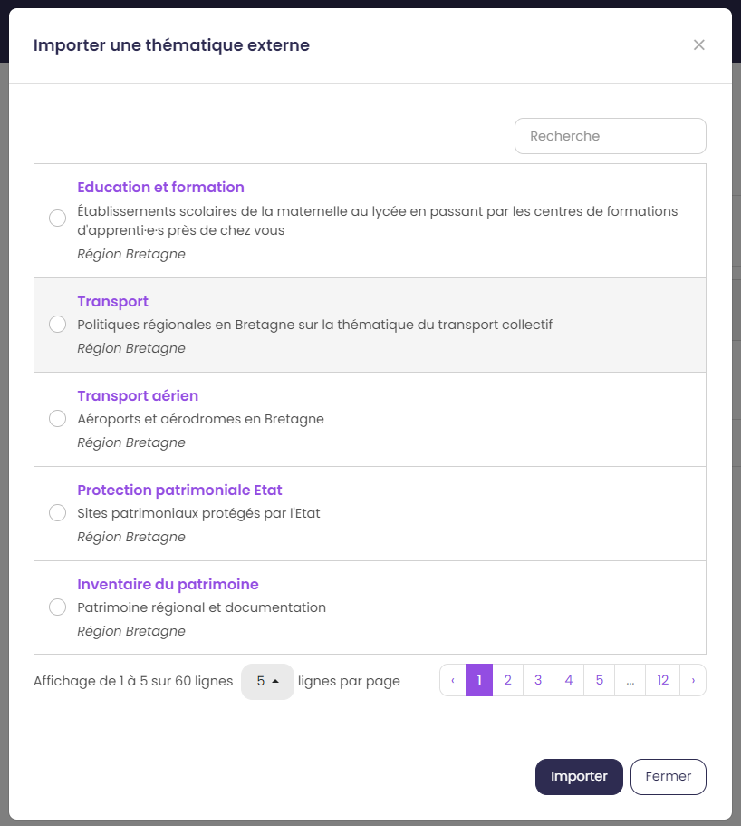
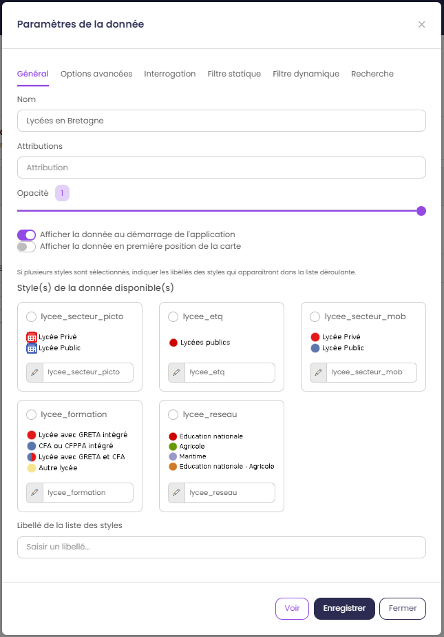

.. Authors : 
.. mviewer team

.. _param_data:

2) Thématiques & données
=========================

Définir les thématiques et les données de son application.

.. image:: ../_images/user/mviewerstudio_2_thematiques.png
              :alt: Définition thématique
              :align: center

Paramétrer ses thématiques
-------------------------------------------

L'utilisateur peut organiser le panneau des thématiques et des données présentes à gauche de l'application.

Le mot "données" correspond à un ou des jeu(x) de données que vous souhaitez ajouter à votre application. Vous avez la possibilité de regrouper un ou plusieurs jeux de données sous une "thématique". Exemple, je veux ajouter les deux couches de données (linéaire du plan vélo et des abris vélo) sous une thématique "Plan Vélo".

Deux options sont offertes à l'utilisateur pour définir ses thématiques :

  1. Créer : pour créer votre thématique et y associer vos jeux de données "métier"
  2. Importer : pour réutiliser une thématique déjà créée au sein de la communauté mviewer (ex. la thématique des découpages territoriaux qui contient les limites de communes, EPCI et départements)

Option - Créer une thématique
~~~~~~~~~~~~~~~~~~~~~~~~~~~~~~

En cliquant sur le bouton créer, une fenêtre de paramétrage de la thématique sélectionnée s'ouvre.

.. image:: ../_images/user/mviewerstudio_2_thematiques_creer.png
              :alt: Création thématique
              :align: center

- ``Nom`` : renseigner le nom de la thématique (ex. Ports).

- ``Déroulée par défaut`` : option permettant d'afficher le contenu de la thématique par défaut

- ``Icône`` : sélectionner l'icône illustrant la thématique. Pour rechercher un mot clé en anglais, utiliser la recherche du navigateur (taper CRTL+F).

Option - Importer une thématique une thématique
~~~~~~~~~~~~~~~~~~~~~~~~~~~~~~~~~~~~~~~~~~~~~~~~

En cliquant sur Importer, possibilité d'importer une·des thématique·s existante·s (voir option external_themes dans :ref:`config`).

Paramétrer ses données
-------------------------------------------

Il est ensuite nécessaire d'ajouter des données à cette thématique via le bouton |ajout_donnees|.

.. |ajout_donnees| image:: ../_images/user/mviewerstudio_2_thematiques_bouton_ajouter_donnees.png
              :alt: Ajouter une donnée 
	      :width: 100 pt

Ajouter une donnée
~~~~~~~~~~~~~~~~~~~

Vous pouvez chercher un jeu de données dans un catalogue (ex. Région Bretagne). Vous pouvez valider votre recherche en tapant sur la touche Entrée de votre clavier ou sur l'icone loupe :

.. image:: ../_images/user/mviewerstudio_2_thematiques_donnees.png
              :alt: Ajouter une donnée
              :align: center

- par mot-clé :

.. image:: ../_images/user/mviewerstudio_2_thematiques_donnees1.png
              :alt: Chercher une donnée
              :align: center

- :guilabel:`mode avancé` en renseignant l'adresse du catalogue fournisseur ou d'un service WMS

.. image:: ../_images/user/mviewerstudio_2_thematiques_donnees_avance.png
              :alt: Chercher une donnée
              :align: center

Une fois cliqué sur Séléctionner, la donnée est ajoutée à l'arborescence. Vous pouvez modifier les paramétrages en cliquant sur |parametrage|.

.. image:: ../_images/user/mviewerstudio_2_ajout_donnee.png
              :alt: Donnée ajoutée
              :align: center

.. |parametrage| image:: ../_images/user/mviewerstudio_2_parametrage.png
              :alt: Editer cette donnée 
	      :width: 20 pt

Onglet Général
~~~~~~~~~~~~~~~

L'onglet général recense les principales options de la donnée.

* ``Nom`` : nom de la donnée dans notre application.
* ``Attributions`` : source de la donnée.
* ``Opacité`` : opacité par défaut de la donnée.
* ``Afficher la donnée au démarrage de l'application`` : la donnée s'affiche au lancement de l'application.
* ``Styles disponibles`` : choix du·des style·s de la donnée dans notre application. Possibilité d'éditer le libellé du style.

Onglet Interrogation
~~~~~~~~~~~~~~~~~~~~~

L'onglet interrogation recense les options relatives à l'interrogation de la donnée.

.. image:: ../_images/user/mviewerstudio_2_donnees_interrogation.png
              :alt: Onglet Général
              :align: center

* ``Activer l'interrogation de la donnée au clic sur la carte`` : active l'interrogation de la donnée.
* ``Position de la fiche d'information`` : affichage de la fiche d'information à droite ou en bas.
* :guilabel:`mode avancé` ``Limitation du nombre de réponses`` : limitation du nombre d'entités interrogées.
* ``Format de la fiche d'information`` : personnalisation possible de la fiche d'information.

        * Choix du type : titre, texte, lien ou image.
        * Choix du label 
        * Choix de l'ordre d'affichage dans la fiche d'information

Onglet filtre dynamique
~~~~~~~~~~~~~~~~~~~~~~~~

L'onglet filtre dynamique permet de filtrer la donnée via une liste déroulante entre différentes valeurs.

.. image:: ../_images/user/mviewerstudio_2_donnees_filtre_dynamique.png
              :alt: Filtre dynamique
              :align: center

* ``Nom du filtre`` : nom du filtre dans l'application.
* ``Champs à filtrer`` : champ sur lequel le filtre va être effectué.
* ``Valeur(s) sélectionnée(s)`` : valeurs disponibles dans le filtre.

Onglet options avancées
~~~~~~~~~~~~~~~~~~~~~~~~

L'onglet options avancées donne accès aux fonctionnalités avancées.

.. image:: ../_images/user/mviewerstudio_2_donnees_avancees.png
              :alt: Options avancées
              :align: center

Onglet filtre statique
~~~~~~~~~~~~~~~~~~~~~~~

L'onglet filtre statique permet de filtrer les données à afficher sur la carte.

.. image:: ../_images/user/mviewerstudio_2_filtre_statique.png
              :alt: Filtre statique
              :align: center

Onglet recherche
~~~~~~~~~~~~~~~~~

L'onglet filtre dynamique permet de filtrer la donnée via une liste déroulante entre différentes valeurs.

.. image:: ../_images/user/mviewerstudio_2_donnees_recherche.png
              :alt: Filtre dynamique
              :align: center