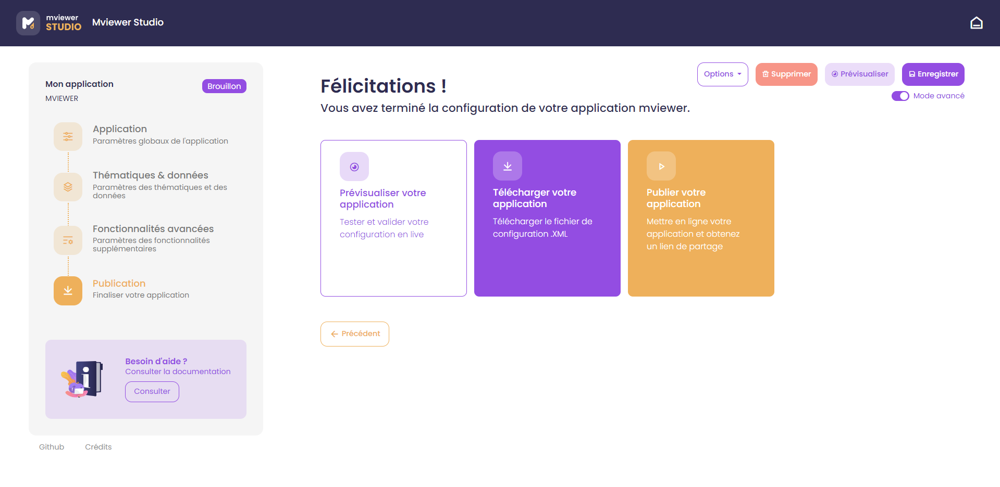
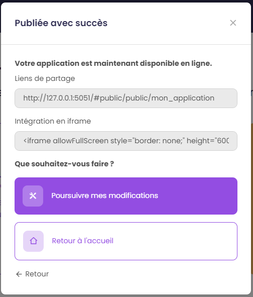

.. Authors :
.. mviewer team

.. _publication:

3) Publier son application
==========================

La configuration de votre application est terminée. Vous pouvez prévisualiser le résultat et télécharger le fichier .XML pour le déposer ensuite sur un serveur en production.

Publier une application depuis le studio
-------------------------------------------

.. note:: Note
        Cette fonctionnalité est disponible si et seulement si l'instance sur laquelle vous créez votre application est configurée pour publier une application en production.

Pour publier votre application, cliquez sur "Publier votre application". Une nouvelle fenêtre s'ouvre :

* ``Nouveau nom`` : nom de l'application publiée, par défaut c'est le nom saisie lors de la création. Ce nom sera visible dans le lien de l'application et sera également le nom du dossier sur le serveur.

Pour valider le processus, cliquez sur "Publier votre application". 

Une fenêtre indique que l'application a été publiée avec succès :

* ``Lien de partage`` : Lien de l'application en production permettant d'y accéder
* ``Intégration en iframe`` : Code HTML à copier/coller pour intégrer la carte dans une page web 

Vous pouvez ensuite poursuivre vos modifications ou retourner à l'accueil.

